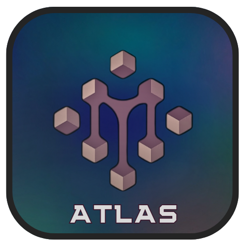

# ميزات Atlas AI الجديدة

)
[](FEATURES.md)

## 🔑 نظام إدارة API Keys المحسن

### المفاتيح الافتراضية المجانية

- **Groq**: مفتاح افتراضي مجاني للاستخدام الفوري
- **GPTGod**: مفتاح افتراضي مجاني مع 17 نموذج
- **Tavily**: مفتاح افتراضي للبحث في الويب

### نظام Fallback الذكي

```dart
// إذا لم يدخل المستخدم مفتاحاً، يتم استخدام المفتاح الافتراضي
final groqKey = await ApiKeyManager.getApiKey('groq');
```

### المفاتيح المخصصة

- إمكانية إدخال مفاتيح المستخدم الخاصة
- إلغاء المفاتيح الافتراضية عند إدخال مفتاح مخصص
- حفظ المفاتيح محلياً على الجهاز

## 🤖 النماذج المجانية المتاحة

### Groq Models (10 نماذج)

#### 1. Llama 3.1 8B

- **الوصف**: نموذج سريع ومتوازن للاستخدام العام
- **السرعة**: سريع جداً
- **الجودة**: جيد
- **السياق**: 8K tokens
- **المميزات**: سريع، متوازن، مناسب للاستخدام العام

#### 2. Llama 3.1 70B

- **الوصف**: نموذج متقدم للاستخدامات المعقدة
- **السرعة**: سريع
- **الجودة**: ممتاز
- **السياق**: 8K tokens
- **المميزات**: دقة عالية، منطق متقدم، مناسب للمهام المعقدة

#### 3. Mixtral 8x7B

- **الوصف**: نموذج متخصص في البرمجة والتحليل
- **السرعة**: سريع
- **الجودة**: ممتاز
- **السياق**: 32K tokens
- **المميزات**: ممتاز في البرمجة، تحليل دقيق، منطق قوي

#### 4. Gemma 2 9B

- **الوصف**: نموذج Google المحدث للاستخدام العام
- **السرعة**: سريع جداً
- **الجودة**: جيد جداً
- **السياق**: 8K tokens
- **المميزات**: محدث، متوازن، مناسب للاستخدام العام

#### 5. Gemma 2 27B

- **الوصف**: نموذج Google المتقدم للاستخدامات المعقدة
- **السرعة**: متوسط
- **الجودة**: ممتاز
- **السياق**: 8K tokens
- **المميزات**: دقة عالية، منطق متقدم، مناسب للمهام المعقدة

#### 6. Llama 3.1 8B Instant

- **الوصف**: نموذج سريع جداً للاستجابة الفورية
- **السرعة**: سريع جداً
- **الجودة**: جيد
- **السياق**: 8K tokens
- **المميزات**: سريع جداً، استجابة فورية، مناسب للمحادثات

#### 7. Llama 3.1 70B Versatile

- **الوصف**: نموذج متعدد الاستخدامات للاستخدامات المختلفة
- **السرعة**: سريع
- **الجودة**: ممتاز
- **السياق**: 8K tokens
- **المميزات**: متعدد الاستخدامات، دقة عالية، منطق متقدم

#### 8. Llama 3.1 405B Reasoning

- **الوصف**: نموذج متخصص في التفكير المنطقي والتحليل
- **السرعة**: متوسط
- **الجودة**: ممتاز جداً
- **السياق**: 8K tokens
- **المميزات**: تفكير منطقي متقدم، تحليل دقيق، منطق قوي

#### 9. Llama 3.1 1B Instruct

- **الوصف**: نموذج صغير وسريع للتعليمات البسيطة
- **السرعة**: سريع جداً
- **الجودة**: جيد
- **السياق**: 8K tokens
- **المميزات**: صغير وسريع، مناسب للتعليمات البسيطة، استجابة سريعة

#### 10. Llama 3.1 3B Instruct

- **الوصف**: نموذج متوسط الحجم للتعليمات المتقدمة
- **السرعة**: سريع
- **الجودة**: جيد جداً
- **السياق**: 8K tokens
- **المميزات**: متوازن، تعليمات متقدمة، استجابة سريعة

### GPTGod Models (17 نموذج)

#### 1. Claude 3 Opus

- **الوصف**: نموذج Anthropic الرائد للمهام المعقدة
- **السرعة**: متوسط
- **الجودة**: ممتاز جداً
- **السياق**: 200K tokens
- **المميزات**: فهم عميق، تحليل متقدم، إبداع عالي

#### 2. Claude 3.5 Sonnet

- **الوصف**: نموذج Anthropic المحدث والمتوازن
- **السرعة**: سريع
- **الجودة**: ممتاز
- **السياق**: 200K tokens
- **المميزات**: متوازن، سريع، دقة عالية

#### 3. Claude 3 Haiku

- **الوصف**: نموذج Anthropic السريع للمهام البسيطة
- **السرعة**: سريع جداً
- **الجودة**: جيد
- **السياق**: 200K tokens
- **المميزات**: سريع جداً، استجابة فورية، فعال للمهام البسيطة

#### 4. GPT-4 Turbo

- **الوصف**: نموذج OpenAI الأحدث والأسرع
- **السرعة**: سريع
- **الجودة**: ممتاز
- **السياق**: 128K tokens
- **المميزات**: محدث، متطور، دقة عالية

#### 5. GPT-4o

- **الوصف**: نموذج OpenAI المحسن للمهام المتعددة
- **السرعة**: سريع
- **الجودة**: ممتاز
- **السياق**: 128K tokens
- **المميزات**: متعدد الوسائط، محسن، دقة عالية

#### 6. GPT-4o Mini

- **الوصف**: نموذج OpenAI الصغير والسريع
- **السرعة**: سريع جداً
- **الجودة**: جيد جداً
- **السياق**: 128K tokens
- **المميزات**: صغير وسريع، فعال، استجابة سريعة

#### 7. Gemini Pro 1.5

- **الوصف**: نموذج Google الأحدث والمتطور
- **السرعة**: سريع
- **الجودة**: ممتاز
- **السياق**: 1M tokens
- **المميزات**: سياق كبير جداً، متطور، دقة عالية

#### 8. Gemini Flash 1.5

- **الوصف**: نموذج Google السريع للاستجابة الفورية
- **السرعة**: سريع جداً
- **الجودة**: جيد جداً
- **السياق**: 1M tokens
- **المميزات**: سريع جداً، سياق كبير، استجابة فورية

#### 9. Llama 3.1 8B (GPTGod)

- **الوصف**: نموذج Meta عبر منصة GPTGod
- **السرعة**: سريع جداً
- **الجودة**: جيد
- **السياق**: 8K tokens
- **المميزات**: سريع، متوازن، مناسب للاستخدام العام

#### 10. Llama 3.1 70B (GPTGod)

- **الوصف**: نموذج Meta المتقدم عبر منصة GPTGod
- **السرعة**: سريع
- **الجودة**: ممتاز
- **السياق**: 8K tokens
- **المميزات**: دقة عالية، منطق متقدم، مناسب للمهام المعقدة

#### 11. Mistral Large

- **الوصف**: نموذج Mistral الكبير للمهام المعقدة
- **السرعة**: متوسط
- **الجودة**: ممتاز
- **السياق**: 32K tokens
- **المميزات**: قوي، متطور، مناسب للمهام المعقدة

#### 12. Mistral Small

- **الوصف**: نموذج Mistral الصغير والسريع
- **السرعة**: سريع جداً
- **الجودة**: جيد
- **السياق**: 32K tokens
- **المميزات**: سريع، فعال، مناسب للمهام البسيطة

#### 13. Codestral

- **الوصف**: نموذج Mistral المتخصص في البرمجة
- **السرعة**: سريع
- **الجودة**: ممتاز
- **السياق**: 32K tokens
- **المميزات**: متخصص في البرمجة، دقة عالية في الكود، تحليل متقدم

#### 14. Command R+

- **الوصف**: نموذج Cohere المتطور للمهام المعقدة
- **السرعة**: متوسط
- **الجودة**: ممتاز
- **السياق**: 128K tokens
- **المميزات**: متطور، دقة عالية، مناسب للتحليل

#### 15. Command R

- **الوصف**: نموذج Cohere المتوازن للاستخدام العام
- **السرعة**: سريع
- **الجودة**: جيد جداً
- **السياق**: 128K tokens
- **المميزات**: متوازن، فعال، مناسب للاستخدام العام

#### 16. Perplexity Llama 3.1 70B

- **الوصف**: نموذج Llama محسن عبر منصة Perplexity
- **السرعة**: سريع
- **الجودة**: ممتاز
- **السياق**: 8K tokens
- **المميزات**: محسن، بحث متقدم، دقة عالية

#### 17. Perplexity Llama 3.1 8B

- **الوصف**: نموذج Llama السريع عبر منصة Perplexity
- **السرعة**: سريع جداً
- **الجودة**: جيد جداً
- **السياق**: 8K tokens
- **المميزات**: سريع، بحث فعال، استجابة سريعة

## 🌐 خدمة Tavily للبحث

### البحث الذكي في الويب

- **بحث في الوقت الفعلي**: استخراج أحدث المعلومات من الإنترنت
- **تلخيص ذكي**: تلخيص نتائج البحث بشكل ذكي
- **مصادر موثوقة**: البحث في مصادر معتمدة وموثوقة
- **دعم اللغة العربية**: البحث والتلخيص باللغة العربية

### ميزات البحث المتقدمة

```dart
// استخدام خدمة Tavily للبحث
final searchResults = await TavilyService.search(
  query: 'أحدث أخبار الذكاء الاصطناعي',
  language: 'ar',
  maxResults: 10
);
```

## 🎯 ميزات تطوير النماذج

### خدمة Fine-Tuning Advisor

- **تحليل البيانات**: تحليل ذكي لبيانات التدريب
- **اقتراح المعاملات**: اقتراح أفضل معاملات التدريب
- **مراقبة الأداء**: مراقبة تقدم التدريب في الوقت الفعلي
- **تحسين تلقائي**: تحسين تلقائي للنموذج أثناء التدريب

### خدمة تدريب النماذج المبسطة

```dart
// بدء تدريب مبسط للنموذج
final trainingSession = await SimpleModelTrainingService.startTraining(
  dataPath: 'path/to/training/data',
  modelType: 'llama',
  epochs: 10
);
```

## 📱 ميزات التطبيق المتقدمة

### إدارة الذاكرة الذكية

- **MCP Protocol**: استخدام بروتوكول سياق النموذج للذاكرة المحسنة
- **ذاكرة طويلة المدى**: حفظ المحادثات والسياق لفترات طويلة
- **استرجاع ذكي**: استرجاع المعلومات ذات الصلة من المحادثات السابقة

### تحسينات الأداء

- **محسن التطبيق**: تحسين شامل لأداء التطبيق
- **محسن قاعدة البيانات**: تحسين استعلامات قاعدة البيانات
- **محسن الصور**: ضغط وتحسين الصور تلقائياً
- **محسن الشبكة**: تحسين طلبات الشبكة والتخزين المؤقت

### خدمة الصوت المتقدمة

```dart
// استخدام خدمة التعرف على الصوت
final speechResult = await SpeechService.recognizeSpeech(
  language: 'ar-SA',
  timeout: 30
);
```

## 🔧 API ونظام إدارة المفاتيح

### إدارة المفاتيح المتقدمة

```dart
// الحصول على مفتاح API
final groqKey = await ApiKeyManager.getApiKey('groq');

// التحقق من استخدام المفاتيح الافتراضية
final isUsingDefault = await ApiKeyManager.isUsingDefaultKeys();

// حفظ مفتاح مخصص
await ApiKeyManager.saveCustomKey('groq', 'your_custom_key');

// إزالة مفتاح مخصص والعودة للافتراضي
await ApiKeyManager.removeCustomKey('groq');
```

### نظام Fallback للمفاتيح

- **مفاتيح افتراضية**: مفاتيح مجانية للاستخدام الفوري
- **مفاتيح مخصصة**: إمكانية إدخال مفاتيح المستخدم
- **نظام التبديل**: التبديل التلقائي بين المفاتيح عند الحاجة
- **حماية المفاتيح**: تشفير وحماية مفاتيح API

## 💾 تصدير وإدارة البيانات

### خدمة تصدير المحادثات

- **تنسيقات متعددة**: تصدير بصيغ JSON، CSV، TXT
- **تصدير مخصص**: اختيار المحادثات والفترات الزمنية
- **ضغط البيانات**: ضغط الملفات الكبيرة تلقائياً
- **حماية البيانات**: تشفير البيانات المصدرة

```dart
// تصدير المحادثات
final exportResult = await ChatExportService.exportChats(
  format: ExportFormat.json,
  dateRange: DateRange.lastMonth,
  includeMedia: true
);
```

## 🎨 واجهة المستخدم المتقدمة

### نظام الثيمات الذكي

- **Material Design 3**: أحدث معايير التصميم
- **ثيمات ديناميكية**: تغيير الألوان حسب المحتوى
- **دعم RTL**: دعم كامل للغات من اليمين لليسار
- **رسوم متحركة متقدمة**: انتقالات سلسة ومؤثرات بصرية

### ويدجت متخصصة

- **فقاعات المحادثة**: تصميم حديث للرسائل
- **لوحة التصحيح**: أدوات تطوير متقدمة
- **ويدجت التدريب**: واجهات لمراقبة تدريب النماذج
- **ويدجت البحث**: واجهة بحث متقدمة في المحادثات

## 📊 إدارة الأذونات والأمان

### مدير الأذونات

```dart
// طلب أذونات متعددة
final permissions = await PermissionsManager.requestPermissions([
  Permission.microphone,
  Permission.storage,
  Permission.camera
]);
```

### ميزات الأمان

- **تشفير البيانات**: تشفير قاعدة البيانات المحلية
- **حماية الذاكرة**: مسح البيانات الحساسة من الذاكرة
- **مصادقة المستخدم**: خيارات مصادقة متعددة
- **سجل الأنشطة**: تسجيل العمليات الحساسة

## 🚀 ميزات التطوير

### تهيئة الخدمات التدريجية

- **تحميل ذكي**: تحميل الخدمات عند الحاجة فقط
- **ذاكرة محسنة**: تقليل استهلاك الذاكرة
- **بدء تشغيل سريع**: تسريع وقت بدء التطبيق

### خدمة تحسين الاستعلامات

```dart
// تحسين الاستعلام تلقائياً
final enhancedPrompt = await PromptEnhancerService.enhancePrompt(
  originalPrompt: 'اشرح لي الذكاء الاصطناعي',
  context: ConversationContext.technical,
  language: 'ar'
);
```

## 📱 الدعم

- **البريد الإلكتروني**: <alromaihi2224@gmail.com>
- **GitHub Issues**: [https://github.com/Msr7799/Atlas-AI.git]
- **التوثيق**: README.md و FEATURES.md و README-ar.md

---

**Atlas AI** - مساعدك الذكي للذكاء الاصطناعي باللغة العربية 🤖

**المطور**: Mohamed S AL-Romaihi  
**البريد الإلكتروني**: alromaihi2224@gmail.com  
**GitHub**: [@Msr7799](https://github.com/Msr7799)
