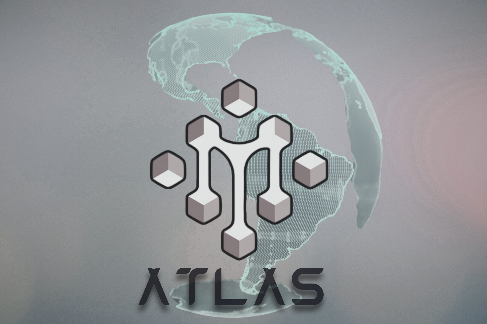

# Atlas AI - مساعد الذكاء الاصطناعي العربي 🤖



[](https://flutter.dev/)
[](https://dart.dev/)
[](LICENSE)
[](mailto:alromaihi2224@gmail.com)

## مساعد الذكاء الاصطناعي العربي

**Atlas AI** هو مساعد ذكاء اصطناعي متقدم يدعم اللغة العربية بشكل أصلي، مع ميزات متطورة للتفاعل والتعلم.

### ✨ الميزات الرئيسية

- 🤖 **دعم أصلي للغة العربية** - تفاعل طبيعي باللغة العربية
- 🧠 **نماذج ذكاء اصطناعي متعددة** - دعم Groq، GPTGod، وTavily
- 💾 **حفظ المحادثات** - سجل كامل للمحادثات مع إمكانية البحث
- 🎨 **واجهة مستخدم عصرية** - تصميم متجاوب مع دعم الوضع المظلم والفاتح
- ⚡ **أداء محسن** - تحسينات شاملة للذاكرة والسرعة
- 📱 **متعدد المنصات** - يعمل على Android، iOS، Windows، Linux، macOS
- 🔐 **أمان متقدم** - حماية البيانات وتشفير المفاتيح

### 👨‍💻 المطور

**Mohamed S AL-Romaihi**
- 📧 البريد الإلكتروني: alromaihi2224@gmail.com

### 🐛 الإبلاغ عن المشاكل

إذا واجهت أي مشكلة أو لديك اقتراح، يرجى التواصل عبر:

📧 **البريد الإلكتروني:** alromaihi2224@gmail.com

---

**Atlas AI** - مساعدك الذكي باللغة العربية 🤖

**👨‍💻 المطور:** Mohamed S AL-Romaihi  
**📧 الدعم الفني:** alromaihi2224@gmail.com

## ✨ المميزات الرئيسية

### 🧠 **ذكاء اصطناعي متقدم**
- دعم كامل للغة العربية مع نماذج Groq المتطورة
- خدمة التدريب المتقدم (Fine-Tuning Advisor Service)
- نظام تفكير متسلسل للحلول المعقدة
- ذاكرة محادثة ذكية مع MCP (Model Context Protocol)

### 🎨 **واجهة مستخدم حديثة**
- تصميم Material Design 3 مع دعم الثيمات
- رسوم متحركة متقدمة ومؤثرات بصرية
- دعم الأنماط المظلمة والفاتحة
- واجهة محادثة تفاعلية مع دعم الملفات

### 🔧 **أدوات تطوير متطورة**
- تكامل مع Tavily API للبحث الذكي
- نظام MCP للذاكرة المتقدمة
- دعم تحليل البيانات المتخصصة
- لوحة تحكم للمطورين (Debug Panel)

### 📱 **منصات متعددة**
- دعم كامل لأنظمة Android, iOS, Web, Linux, Windows, macOS
- استجابة كاملة لجميع أحجام الشاشات
- أداء محسن لكافة المنصات

## 🚀 البدء السريع

### متطلبات النظام

```bash
# Flutter SDK
Flutter 3.8.1 أو أحدث
Dart 3.8.1 أو أحدث

# أدوات إضافية
Git
Node.js (لخدمات MCP)
```

### التثبيت

1. **استنساخ المشروع:**
```bash
git clone https://github.com/Msr7799/Fine_tuning_AI.git
cd Fine_tuning_AI
```

2. **تثبيت التبعيات:**
```bash
flutter pub get
```

3. **إعداد متغيرات البيئة:**
```bash
# إنشاء ملف .env في الجذر
cp .env.example .env

# تحرير الملف وإضافة مفاتيح API
GROQ_API_KEY=your_groq_api_key_here
TAVILY_API_KEY=your_tavily_api_key_here
TRAVILY_URL_API_PAIRED=your_mcp_endpoint_here
```

4. **تشغيل التطبيق:**
```bash
# لأجهزة Android/iOS
flutter run

# للويب
flutter run -d chrome

# لسطح المكتب
flutter run -d linux   # أو windows أو macos
```

## 🏗️ معمارية المشروع

```
lib/
├── 🔧 core/                    # النواة الأساسية
│   ├── config/                 # إعدادات التطبيق
│   │   └── app_config.dart             # إعدادات التطبيق
│   ├── performance/            # تحسينات الأداء
│   │   ├── app_optimizer.dart          # محسن التطبيق
│   │   ├── database_optimizer.dart     # أداء قاعدة البيانات
│   │   ├── image_optimizer.dart        # معالجة الصور
│   │   ├── network_optimizer.dart      # تحسين الشبكة
│   │   ├── performance_optimizer.dart  # الأداء العام
│   │   └── performance_report.dart     # تقارير الأداء
│   ├── services/               # الخدمات الأساسية
│   │   ├── api_key_manager.dart        # إدارة مفاتيح API
│   │   ├── chat_export_service.dart    # خدمة تصدير المحادثات
│   │   ├── fine_tuning_advisor_service.dart # مستشار التدريب المتطور
│   │   ├── gptgod_service.dart         # تكامل GPTGod API
│   │   ├── groq_service.dart           # خدمة Groq AI
│   │   ├── lazy_service_initializer.dart # خدمات التحميل الكسول
│   │   ├── mcp_service.dart            # بروتوكول السياق للنماذج
│   │   ├── model_training_service.dart  # خدمة تدريب النماذج
│   │   ├── prompt_enhancer_service.dart # تحسين الأوامر
│   │   ├── simple_model_training_service.dart # التدريب البسيط
│   │   └── tavily_service.dart         # خدمة البحث الذكي
│   ├── theme/                  # نظام الثيمات
│   │   ├── app_theme.dart              # ثيمات التطبيق
│   │   └── unified_theme.dart          # النظام الموحد للثيمات
│   ├── utils/                  # أدوات مساعدة
│   │   ├── asset_optimizer.dart        # تحسين الأصول
│   │   ├── memory_manager.dart         # إدارة الذاكرة
│   │   ├── performance_monitor.dart    # مراقبة الأداء
│   │   └── speech_stub.dart            # وظائف الصوت
│   └── widgets/                # عناصر النواة
│       └── optimized_widgets.dart      # عناصر محسنة للأداء
├── 💾 data/                    # طبقة البيانات
│   ├── datasources/            # مصادر البيانات
│   │   └── database_helper.dart        # مساعد قاعدة البيانات SQLite
│   ├── models/                 # نماذج البيانات
│   │   ├── attachment_model.dart       # نموذج المرفقات
│   │   ├── message_model.dart          # نموذج رسائل المحادثة
│   │   ├── message_model.g.dart        # كود النموذج المولد
│   │   └── thinking_process_model.dart # نموذج عملية التفكير للذكاء الاصطناعي
│   └── repositories/           # مستودعات البيانات
│       └── chat_repository.dart        # مستودع بيانات المحادثة
├── � presentation/            # طبقة العرض
│   ├── pages/                  # صفحات التطبيق
│   │   ├── api_settings_page.dart      # صفحة إعدادات API
│   │   ├── main_chat_page.dart         # واجهة المحادثة الرئيسية
│   │   └── model_training_page.dart    # صفحة تدريب النماذج
│   ├── providers/              # مزودي الحالة
│   │   ├── chat_provider.dart          # إدارة حالة المحادثة
│   │   ├── chat_selection_provider.dart # حالة اختيار المحادثة
│   │   ├── prompt_enhancer_provider.dart # تحسين الأوامر
│   │   ├── settings_provider.dart      # حالة إعدادات التطبيق
│   │   ├── theme_provider.dart         # إدارة الثيمات
│   │   └── training_provider.dart      # حالة التدريب
│   └── widgets/               # مكونات واجهة المستخدم
│       ├── attachment_preview.dart     # عرض المرفقات
│       ├── chat_drawer.dart            # درج التنقل
│       ├── chat_export_dialog.dart     # حوار التصدير
│       ├── debug_panel.dart            # لوحة تطوير للمطورين
│       ├── message_bubble.dart         # فقاعة رسائل المحادثة
│       ├── prompt_enhancement_dialog.dart # واجهة تحسين الأوامر
│       ├── settings_dialog.dart        # حوار الإعدادات
│       ├── thinking_process_widget.dart # عرض عملية التفكير للذكاء الاصطناعي
│       ├── training_config_widget.dart # إعدادات التدريب
│       ├── training_logs_widget.dart   # عرض سجلات التدريب
│       └── training_progress_widget.dart # عرض تقدم التدريب
└── main.dart                   # نقطة دخول التطبيق
```

## 🛠️ التقنيات المستخدمة

### 📱 **تطوير التطبيق**
- **Flutter 3.8.1+** - إطار العمل الأساسي
- **Dart 3.8.1+** - لغة البرمجة
- **Provider** - إدارة الحالة
- **Dio** - طلبات HTTP متقدمة

### 🤖 **ذكاء اصطناعي**
- **Groq API** - نماذج اللغة المتطورة
- **Tavily API** - البحث الذكي والاستخراج
- **MCP Protocol** - بروتوكول السياق للنماذج

### 💾 **قاعدة البيانات**
- **SQLite** - قاعدة بيانات محلية
- **Shared Preferences** - تخزين الإعدادات
- **File System** - إدارة الملفات

### 🎨 **واجهة المستخدم**
- **Material Design 3** - نظام التصميم
- **Google Fonts** - خطوط متنوعة
- **Lottie** - الرسوم المتحركة
- **Flutter Animate** - تأثيرات متقدمة

## 📖 دليل الاستخدام

### 💬 **المحادثة الذكية**
1. اكتب رسالتك في حقل النص
2. أرفق ملفات إضافية إذا لزم الأمر
3. اضغط إرسال للحصول على إجابة ذكية
4. استخدم أوامر خاصة مثل `/help` للمساعدة

### 🔧 **التدريب المتقدم**
```
/finetune [نوع المهمة] - بدء جلسة تدريب متقدم
/analyze [الملف] - تحليل البيانات للتدريب
/optimize [المعاملات] - تحسين النموذج
```

### 🎨 **تخصيص الواجهة**
- غيّر النمط من الإعدادات (فاتح/مظلم)
- اختر ألوان مخصصة من لوحة الألوان
- اضبط حجم الخط ونوعه

### 🔍 **البحث الذكي**
```
/search [استعلام] - بحث ذكي في الويب
/crawl [رابط] - استخراج محتوى موقع
/extract [نص] - استخراج معلومات محددة
```

## ⚙️ الإعدادات المتقدمة

### 🔑 **مفاتيح API**

احصل على مفاتيح API من:
- [Groq Console](https://console.groq.com/) - للذكاء الاصطناعي
- [Tavily API](https://tavily.com/) - للبحث الذكي

### 🐳 **نشر Docker**

```dockerfile
# Dockerfile مثال
FROM cirrusci/flutter:stable

WORKDIR /app
COPY . .

RUN flutter pub get
RUN flutter build web

EXPOSE 8080
CMD ["flutter", "run", "-d", "web-server", "--web-port", "8080"]
```

### ☁️ **النشر السحابي**

```bash
# نشر على Firebase Hosting
firebase deploy

# نشر على Vercel
vercel --prod

# نشر على GitHub Pages
flutter build web --base-href="/Fine_tuning_AI/"
```

## 🤝 المساهمة

نرحب بمساهماتكم! يرجى اتباع الخطوات التالية:

1. **Fork** المستودع
2. إنشاء فرع للميزة (`git checkout -b feature/amazing-feature`)
3. Commit التغييرات (`git commit -m 'Add amazing feature'`)
4. Push للفرع (`git push origin feature/amazing-feature`)
5. فتح **Pull Request**

### 📋 **إرشادات المساهمة**

- اتبع [دليل أسلوب Dart](https://dart.dev/guides/language/effective-dart/style)
- اكتب اختبارات للميزات الجديدة
- حدث الوثائق عند الحاجة
- استخدم أسماء متغيرات واضحة

## 🧪 الاختبار

```bash
# تشغيل جميع الاختبارات
flutter test

# اختبارات مع تقرير التغطية
flutter test --coverage

# اختبارات التكامل
flutter test integration_test/

# تحليل جودة الكود
flutter analyze
```

## 📊 الأداء

- **وقت البدء:** < 2 ثانية
- **استهلاك الذاكرة:** < 100 MB
- **حجم التطبيق:** 
  - Android: ~25 MB
  - iOS: ~30 MB
  - Web: ~5 MB (مضغوط)

## 🔒 الأمان

- تشفير البيانات المحلية
- تأمين مفاتيح API
- عدم تخزين البيانات الحساسة
- اتصالات HTTPS فقط

## 📝 الترخيص

هذا المشروع مرخص تحت رخصة MIT - راجع ملف [LICENSE](LICENSE) للتفاصيل.

## 🙏 شكر وتقدير

- [Flutter Team](https://flutter.dev/) - إطار العمل الرائع
- [Groq](https://groq.com/) - نماذج الذكاء الاصطناعي المتطورة
- [Tavily](https://tavily.com/) - خدمة البحث الذكي
- [Material Design](https://material.io/) - نظام التصميم

## 📞 التواصل

- **المطور:** Mohamed S AL-Romaihi
- **البريد الإلكتروني:** [alromaihi2224@gmail.com](mailto:alromaihi2224@gmail.com)
- **GitHub:** [@Msr7799](https://github.com/Msr7799)
- **المستودع:** [Fine_tuning_AI](https://github.com/Msr7799/Fine_tuning_AI)

---

<div align="center">
  <h3>صنع بـ ❤️ في العالم العربي</h3>
  <p>إذا أعجبك هذا المشروع، لا تنس إعطاؤه ⭐!</p>
</div>
