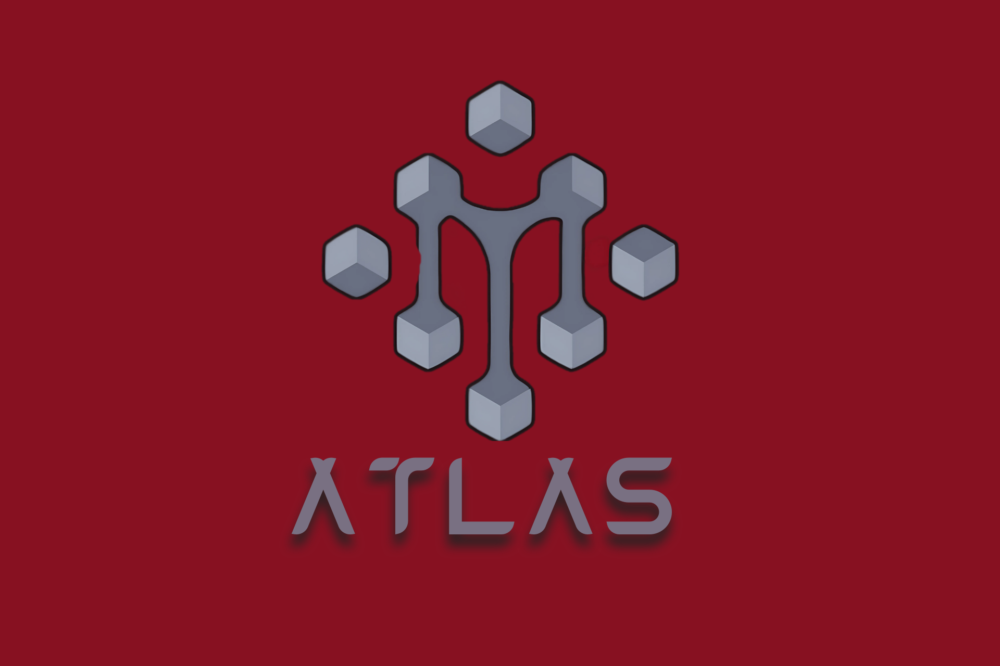

# Atlas AI - مساعد الذكاء الاصطناعي المتقدم


[](https://flutter.dev/)
[](https://dart.dev/)
[](LICENSE)
[](mailto:alromaihi2224@gmail.com)

[](README.md)
[](https://github.com/Msr7799/Atlas-AI/releases)

## نظرة عامة

Atlas AI هو تطبيق مساعد ذكي متطور مبني بـ Flutter، يتميز بالدعم الأصلي للغة العربية والقدرات المتقدمة في المحادثة. يدمج التطبيق نماذج ذكاء اصطناعي متعددة ويوفر تجربة سلسة متعددة المنصات مع تصميم واجهة مستخدم حديثة وتحسينات أداء قوية.

## ✨ المميزات الرئيسية

### 🤖 **تكامل نماذج ذكاء اصطناعي متعددة**
- **نماذج Groq**: 10 نماذج مختلفة بما في ذلك Llama 3.1 و Mixtral و Gemma
- **خدمة GPTGod**: 17 نموذج متقدم مع دعم GPT-4
- **بحث Tavily**: تكامل البحث في الويب في الوقت الفعلي
- **Hugging Face**: الوصول إلى النماذج مفتوحة المصدر
- **الذكاء الاصطناعي المحلي**: دعم النماذج غير المتصلة بالإنترنت

### 🌐 **دعم اللغات**
- **دعم أصلي للعربية**: تخطيط RTL كامل ومعالجة اللغة العربية
- **واجهة متعددة اللغات**: واجهة مستخدم بالإنجليزية والعربية
- **محتوى محلي**: ردود متفهمة للسياق باللغة العربية

### 🎨 **واجهة مستخدم حديثة**
- **Material Design 3**: نظام تصميم حديث ومتجاوب
- **الوضع المظلم/الفاتح**: ثيمات ديناميكية مع تفضيلات المستخدم
- **متعدد المنصات**: تجربة متسقة عبر جميع المنصات
- **إمكانية الوصول**: دعم كامل لإمكانية الوصول

### 🔧 **القدرات المتقدمة**
- **مستشار الضبط الدقيق**: توصيات ذكية لتدريب النماذج
- **تكامل MCP**: بروتوكول سياق النموذج للذاكرة المحسنة
- **إدخال صوتي**: وظيفة تحويل الكلام إلى نص
- **تصدير الدردشة**: تنسيقات تصدير متعددة (JSON، CSV، TXT)
- **تحسين الأداء**: إدارة متقدمة للذاكرة والموارد

### 🔐 **الأمان والخصوصية**
- **إدارة مفاتيح API**: تخزين وإدارة آمنة للمفاتيح
- **تخزين البيانات المحلية**: قاعدة بيانات SQLite مع التشفير
- **إدارة الأذونات**: ضوابط وصول دقيقة
- **الخصوصية أولاً**: لا يتم إرسال البيانات إلى خوادم خارجية دون موافقة

## 🚀 البدء السريع

### المتطلبات المسبقة

- Flutter SDK 3.8.1 أو أحدث
- Dart SDK 3.8.1 أو أحدث
- Android Studio / VS Code
- Git

### التثبيت

1. **استنساخ المستودع**
   ```bash
   git clone https://github.com/Msr7799/Atlas-AI.git
   cd Atlas-AI
   ```

2. **تثبيت التبعيات**
   ```bash
   flutter pub get
   ```

3. **تكوين متغيرات البيئة**
   ```bash
   cp example_.env .env
   # تحرير ملف .env مع مفاتيح API الخاصة بك (اختياري - التطبيق يتضمن مفاتيح افتراضية)
   ```

4. **تشغيل التطبيق**
   ```bash
   flutter run
   ```

## 📱 دعم المنصات

| المنصة | الحالة | ملاحظات |
|----------|--------|-------|
| Android | ✅ | دعم كامل |
| iOS | ✅ | دعم كامل |
| Windows | ✅ | دعم كامل |
| Linux | ✅ | دعم كامل |
| Web | ✅ | ميزات محدودة |

## 🏗️ بنية المشروع

```
lib/
├── main.dart                    # نقطة دخول التطبيق
├── core/                        # منطق العمل الأساسي
│   ├── services/               # خدمات الذكاء الاصطناعي والمنصة
│   ├── performance/           # تحسين الأداء
│   ├── theme/                # ثيمات واجهة المستخدم
│   └── utils/               # دوال مساعدة
├── data/                      # طبقة البيانات
│   ├── models/              # نماذج البيانات
│   ├── repositories/        # مستودعات البيانات
│   └── datasources/        # مصادر البيانات
└── presentation/            # طبقة واجهة المستخدم
    ├── pages/              # شاشات التطبيق
    ├── widgets/           # مكونات واجهة المستخدم القابلة للإعادة
    └── providers/        # إدارة الحالة
```

## 🔧 التكوين

### إعداد مفاتيح API

يأتي التطبيق مع مفاتيح API افتراضية للاستخدام الفوري. للإنتاج أو الاستخدام المكثف، قم بتكوين مفاتيحك الخاصة:

1. انسخ `example_.env` إلى `.env`
2. أضف مفاتيح API الخاصة بك:
   ```
   GROQ_API_KEY=your_groq_key
   GPTGOD_API_KEY=your_gptgod_key
   TAVILY_API_KEY=your_tavily_key
   ```

### النماذج المتاحة للذكاء الاصطناعي

#### نماذج Groq (10 متاح)
- Llama 3.1 8B - نموذج سريع ومتوازن
- Llama 3.1 70B - ردود عالية الجودة
- Mixtral 8x7B - تفكير ممتاز
- Gemma 9B - معالجة فعالة

#### نماذج GPTGod (17 متاح)
- GPT-4 Turbo - أحدث نموذج OpenAI
- Claude 3 Opus - النموذج الرائد من Anthropic
- Gemini Pro - نموذج Google المتقدم

## 🎯 الاستخدام

### الدردشة الأساسية
1. قم بتشغيل التطبيق
2. اختر نموذج الذكاء الاصطناعي المفضل لديك
3. ابدأ بالمحادثة بالعربية أو الإنجليزية

### الإدخال الصوتي
1. اضغط على زر الميكروفون
2. تحدث برسالتك
3. سيقوم التطبيق بنسخ ومعالجة كلامك

### تدريب النماذج
1. انتقل إلى صفحة تدريب النماذج
2. قم بتكوين معاملات التدريب
3. ارفع بيانات التدريب الخاصة بك
4. راقب تقدم التدريب

### تصدير المحادثات
1. افتح درج الدردشة
2. اختر "تصدير الدردشة"
3. اختر التنسيق (JSON/CSV/TXT)
4. احفظ على الجهاز

## 🤝 المساهمة

نرحب بالمساهمات! يرجى اتباع هذه الخطوات:

1. قم بعمل Fork للمستودع
2. أنشئ فرع ميزة (`git checkout -b feature/amazing-feature`)
3. قم بتأكيد تغييراتك (`git commit -m 'Add amazing feature'`)
4. ادفع إلى الفرع (`git push origin feature/amazing-feature`)
5. افتح طلب سحب

### إرشادات التطوير

- اتبع أفضل ممارسات Flutter/Dart
- حافظ على دعم اللغة العربية
- اكتب اختبارات شاملة
- حدث التوثيق
- تأكد من التوافق متعدد المنصات

## 📄 الترخيص

هذا المشروع مرخص تحت رخصة MIT - انظر ملف [LICENSE](LICENSE) للتفاصيل.

## 👨‍💻 المطور

**Mohamed S AL-Romaihi**
- 📧 البريد الإلكتروني: alromaihi2224@gmail.com
- 🌐 GitHub: [ملفك الشخصي على GitHub](https://github.com/Msr7799)

## 🐛 تقارير الأخطاء وطلبات الميزات

إذا واجهت أي مشاكل أو لديك اقتراحات للتحسينات:

📧 **البريد الإلكتروني**: alromaihi2224@gmail.com

يرجى تضمين:
- معلومات الجهاز/المنصة
- خطوات إعادة إنتاج المشكلة
- السلوك المتوقع مقابل الفعلي
- لقطات شاشة (إن أمكن)

## 🙏 شكر وتقدير

- فريق Flutter للإطار المذهل
- موفري نماذج الذكاء الاصطناعي (Groq، OpenAI، Anthropic)
- مساهمي المجتمع مفتوح المصدر
- مجتمع معالجة اللغة العربية

---

**Atlas AI** - تمكين المحادثات بمساعدة الذكاء الاصطناعي الذكي

تم البناء بـ ❤️ بواسطة Mohamed S AL-Romaihi
- رسوم متحركة متقدمة ومؤثرات بصرية
- دعم الأنماط المظلمة والفاتحة
- واجهة محادثة تفاعلية مع دعم الملفات

### 🔧 **أدوات تطوير متطورة**
- تكامل مع Tavily API للبحث الذكي
- نظام MCP للذاكرة المتقدمة
- دعم تحليل البيانات المتخصصة
- لوحة تحكم للمطورين (Debug Panel)

### 📱 **منصات متعددة**
- دعم كامل لأنظمة Android, iOS, Web, Linux, Windows, macOS
- استجابة كاملة لجميع أحجام الشاشات
- أداء محسن لكافة المنصات

## 🚀 البدء السريع

### متطلبات النظام

```bash
# Flutter SDK
Flutter 3.8.1 أو أحدث
Dart 3.8.1 أو أحدث

# أدوات إضافية
Git
Node.js (لخدمات MCP)
```

### التثبيت

1. **استنساخ المشروع:**
```bash
git clone https://github.com/Msr7799/Atlas-AI.git
cd Atlas-AI
```

2. **تثبيت التبعيات:**
```bash
flutter pub get
```

3. **إعداد متغيرات البيئة:**
```bash
# إنشاء ملف .env في الجذر
cp .env.example .env

# تحرير الملف وإضافة مفاتيح API
GROQ_API_KEY=your_groq_api_key_here
TAVILY_API_KEY=your_tavily_api_key_here
TRAVILY_URL_API_PAIRED=your_mcp_endpoint_here
```

4. **تشغيل التطبيق:**
```bash
# لأجهزة Android/iOS
flutter run

# للويب
flutter run -d chrome

# لسطح المكتب
flutter run -d linux   # أو windows أو macos
```

## 🏗️ معمارية المشروع

```
lib/
├── 🔧 core/                    # النواة الأساسية
│   ├── config/                 # إعدادات التطبيق
│   │   └── app_config.dart             # إعدادات التطبيق
│   ├── performance/            # تحسينات الأداء
│   │   ├── app_optimizer.dart          # محسن التطبيق
│   │   ├── database_optimizer.dart     # أداء قاعدة البيانات
│   │   ├── image_optimizer.dart        # معالجة الصور
│   │   ├── network_optimizer.dart      # تحسين الشبكة
│   │   ├── performance_optimizer.dart  # الأداء العام
│   │   └── performance_report.dart     # تقارير الأداء
│   ├── services/               # الخدمات الأساسية
│   │   ├── api_key_manager.dart        # إدارة مفاتيح API
│   │   ├── chat_export_service.dart    # خدمة تصدير المحادثات
│   │   ├── fine_tuning_advisor_service.dart # مستشار التدريب المتطور
│   │   ├── gptgod_service.dart         # تكامل GPTGod API
│   │   ├── groq_service.dart           # خدمة Groq AI
│   │   ├── lazy_service_initializer.dart # خدمات التحميل الكسول
│   │   ├── mcp_service.dart            # بروتوكول السياق للنماذج
│   │   ├── model_training_service.dart  # خدمة تدريب النماذج
│   │   ├── prompt_enhancer_service.dart # تحسين الأوامر
│   │   ├── simple_model_training_service.dart # التدريب البسيط
│   │   └── tavily_service.dart         # خدمة البحث الذكي
│   ├── theme/                  # نظام الثيمات
│   │   ├── app_theme.dart              # ثيمات التطبيق
│   │   └── unified_theme.dart          # النظام الموحد للثيمات
│   ├── utils/                  # أدوات مساعدة
│   │   ├── asset_optimizer.dart        # تحسين الأصول
│   │   ├── memory_manager.dart         # إدارة الذاكرة
│   │   ├── performance_monitor.dart    # مراقبة الأداء
│   │   └── speech_stub.dart            # وظائف الصوت
│   └── widgets/                # عناصر النواة
│       └── optimized_widgets.dart      # عناصر محسنة للأداء
├── 💾 data/                    # طبقة البيانات
│   ├── datasources/            # مصادر البيانات
│   │   └── database_helper.dart        # مساعد قاعدة البيانات SQLite
│   ├── models/                 # نماذج البيانات
│   │   ├── attachment_model.dart       # نموذج المرفقات
│   │   ├── message_model.dart          # نموذج رسائل المحادثة
│   │   ├── message_model.g.dart        # كود النموذج المولد
│   │   └── thinking_process_model.dart # نموذج عملية التفكير للذكاء الاصطناعي
│   └── repositories/           # مستودعات البيانات
│       └── chat_repository.dart        # مستودع بيانات المحادثة
├── � presentation/            # طبقة العرض
│   ├── pages/                  # صفحات التطبيق
│   │   ├── api_settings_page.dart      # صفحة إعدادات API
│   │   ├── main_chat_page.dart         # واجهة المحادثة الرئيسية
│   │   └── model_training_page.dart    # صفحة تدريب النماذج
│   ├── providers/              # مزودي الحالة
│   │   ├── chat_provider.dart          # إدارة حالة المحادثة
│   │   ├── chat_selection_provider.dart # حالة اختيار المحادثة
│   │   ├── prompt_enhancer_provider.dart # تحسين الأوامر
│   │   ├── settings_provider.dart      # حالة إعدادات التطبيق
│   │   ├── theme_provider.dart         # إدارة الثيمات
│   │   └── training_provider.dart      # حالة التدريب
│   └── widgets/               # مكونات واجهة المستخدم
│       ├── attachment_preview.dart     # عرض المرفقات
│       ├── chat_drawer.dart            # درج التنقل
│       ├── chat_export_dialog.dart     # حوار التصدير
│       ├── debug_panel.dart            # لوحة تطوير للمطورين
│       ├── message_bubble.dart         # فقاعة رسائل المحادثة
│       ├── prompt_enhancement_dialog.dart # واجهة تحسين الأوامر
│       ├── settings_dialog.dart        # حوار الإعدادات
│       ├── thinking_process_widget.dart # عرض عملية التفكير للذكاء الاصطناعي
│       ├── training_config_widget.dart # إعدادات التدريب
│       ├── training_logs_widget.dart   # عرض سجلات التدريب
│       └── training_progress_widget.dart # عرض تقدم التدريب
└── main.dart                   # نقطة دخول التطبيق
```

## 🛠️ التقنيات المستخدمة

### 📱 **تطوير التطبيق**
- **Flutter 3.8.1+** - إطار العمل الأساسي
- **Dart 3.8.1+** - لغة البرمجة
- **Provider** - إدارة الحالة
- **Dio** - طلبات HTTP متقدمة

### 🤖 **ذكاء اصطناعي**
- **Groq API** - نماذج اللغة المتطورة
- **Tavily API** - البحث الذكي والاستخراج
- **MCP Protocol** - بروتوكول السياق للنماذج

### 💾 **قاعدة البيانات**
- **SQLite** - قاعدة بيانات محلية
- **Shared Preferences** - تخزين الإعدادات
- **File System** - إدارة الملفات

### 🎨 **واجهة المستخدم**
- **Material Design 3** - نظام التصميم
- **Google Fonts** - خطوط متنوعة
- **Lottie** - الرسوم المتحركة
- **Flutter Animate** - تأثيرات متقدمة

## 📖 دليل الاستخدام

### 💬 **المحادثة الذكية**
1. اكتب رسالتك في حقل النص
2. أرفق ملفات إضافية إذا لزم الأمر
3. اضغط إرسال للحصول على إجابة ذكية
4. استخدم أوامر خاصة مثل `/help` للمساعدة

### 🔧 **التدريب المتقدم**
```
/finetune [نوع المهمة] - بدء جلسة تدريب متقدم
/analyze [الملف] - تحليل البيانات للتدريب
/optimize [المعاملات] - تحسين النموذج
```

### 🎨 **تخصيص الواجهة**
- غيّر النمط من الإعدادات (فاتح/مظلم)
- اختر ألوان مخصصة من لوحة الألوان
- اضبط حجم الخط ونوعه

### 🔍 **البحث الذكي**
```
/search [استعلام] - بحث ذكي في الويب
/crawl [رابط] - استخراج محتوى موقع
/extract [نص] - استخراج معلومات محددة
```

## ⚙️ الإعدادات المتقدمة

### 🔑 **مفاتيح API**

احصل على مفاتيح API من:
- [Groq Console](https://console.groq.com/) - للذكاء الاصطناعي
- [Tavily API](https://tavily.com/) - للبحث الذكي

### 🐳 **نشر Docker**

```dockerfile
# Dockerfile مثال
FROM cirrusci/flutter:stable

WORKDIR /app
COPY . .

RUN flutter pub get
RUN flutter build web

EXPOSE 8080
CMD ["flutter", "run", "-d", "web-server", "--web-port", "8080"]
```

### ☁️ **النشر السحابي**

```bash
# نشر على Firebase Hosting
firebase deploy

# نشر على Vercel
vercel --prod

# نشر على GitHub Pages
flutter build web --base-href="/Fine_tuning_AI/"
```

## 🤝 المساهمة

نرحب بمساهماتكم! يرجى اتباع الخطوات التالية:

1. **Fork** المستودع
2. إنشاء فرع للميزة (`git checkout -b feature/amazing-feature`)
3. Commit التغييرات (`git commit -m 'Add amazing feature'`)
4. Push للفرع (`git push origin feature/amazing-feature`)
5. فتح **Pull Request**

### 📋 **إرشادات المساهمة**

- اتبع [دليل أسلوب Dart](https://dart.dev/guides/language/effective-dart/style)
- اكتب اختبارات للميزات الجديدة
- حدث الوثائق عند الحاجة
- استخدم أسماء متغيرات واضحة

## 🧪 الاختبار

```bash
# تشغيل جميع الاختبارات
flutter test

# اختبارات مع تقرير التغطية
flutter test --coverage

# اختبارات التكامل
flutter test integration_test/

# تحليل جودة الكود
flutter analyze
```

## 📊 الأداء

- **وقت البدء:** < 2 ثانية
- **استهلاك الذاكرة:** < 100 MB
- **حجم التطبيق:** 
  - Android: ~25 MB
  - iOS: ~30 MB
  - Web: ~5 MB (مضغوط)

## 🔒 الأمان

- تشفير البيانات المحلية
- تأمين مفاتيح API
- عدم تخزين البيانات الحساسة
- اتصالات HTTPS فقط

## 📝 الترخيص

هذا المشروع مرخص تحت رخصة MIT - راجع ملف [LICENSE](LICENSE) للتفاصيل.

## 🙏 شكر وتقدير

- [Flutter Team](https://flutter.dev/) - إطار العمل الرائع
- [Groq](https://groq.com/) - نماذج الذكاء الاصطناعي المتطورة
- [Tavily](https://tavily.com/) - خدمة البحث الذكي
- [Material Design](https://material.io/) - نظام التصميم

## 📞 التواصل

- **المطور:** Mohamed S AL-Romaihi
- **البريد الإلكتروني:** [alromaihi2224@gmail.com](mailto:alromaihi2224@gmail.com)
- **GitHub:** [@Msr7799](https://github.com/Msr7799)
- **المستودع:** [Fine_tuning_AI](https://github.com/Msr7799/Fine_tuning_AI)

---

<div align="center">
  <h3>صنع بـ ❤️ في العالم العربي</h3>
  <p>إذا أعجبك هذا المشروع، لا تنس إعطاؤه ⭐!</p>
</div>
