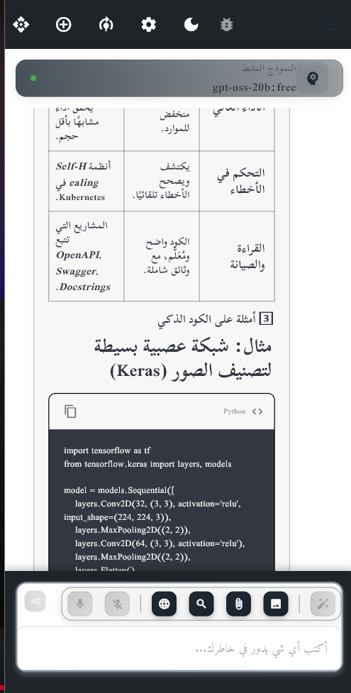
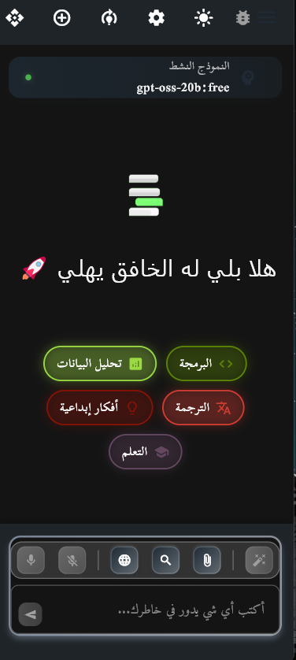
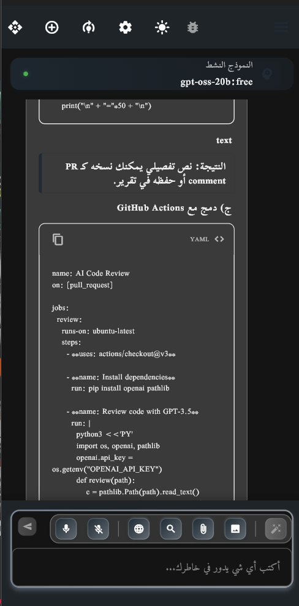
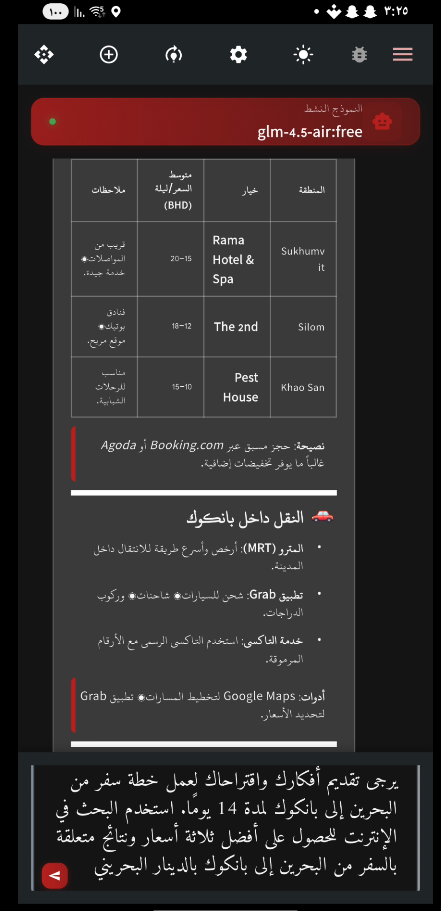
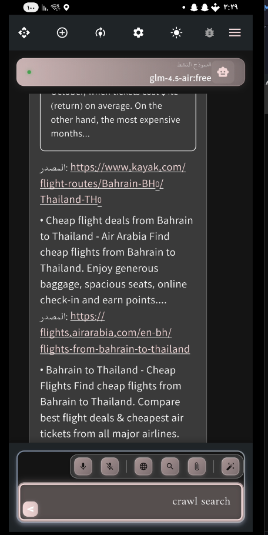
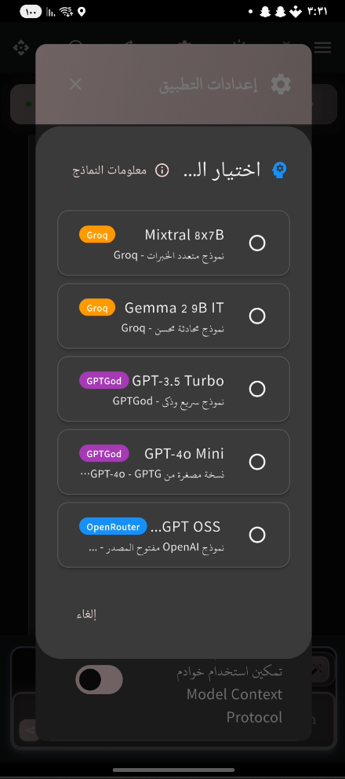
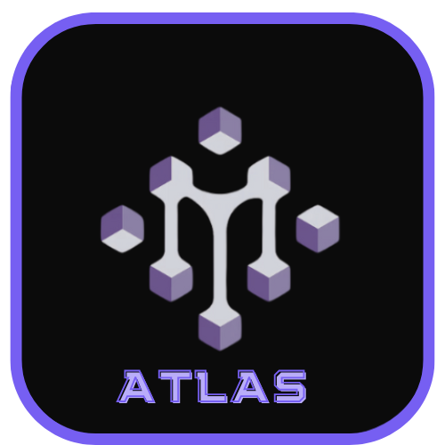

# Atlas AI - Advanced AI Assistant


[](https://flutter.dev/)
[](https://dart.dev/)
[](LICENSE)
[](mailto:alromaihi2224@gmail.com)
[](https://github.com/Msr7799/Atlas-AI)

[](https://github.com/Msr7799/Atlas-AI/releases)

## Overview


[](README-ar.md)


Atlas AI is a sophisticated AI assistant application built with Flutter, featuring native Arabic language support and advanced conversational capabilities. The application integrates multiple AI models and provides a seamless, cross-platform experience with modern UI design and robust performance optimizations.


<div align="center">
  <table>
    <tr>
      <td align="center" style="padding: 50px;">
        
      </td>
      <td align="center" style="padding: 50px;">
        
      </td>
      <td align="center" style="padding: 50px;">
        
      </td>
    </tr>
    <tr>
      <td align="center" style="padding: 50px;">
        
      </td>
      <td align="center" style="padding: 50px;">
        
      </td>
      <td align="center" style="padding: 50px;">
        
      </td>
    </tr>
  </table>
</div>

## ✨ Key Features

[](FEATURES.md)




### 🤖 **Multi-Model AI Integration**
- **Groq Models**: 10 different models including Llama 3.1, Mixtral, and Gemma
- **GPTGod Service**: 17 advanced models with GPT-4 support
- **Tavily Search**: Real-time web search integration
- **Hugging Face**: Access to open-source models
- **Local AI**: Offline model support

### 🌐 **Language Support**
- **Native Arabic Support**: Full RTL layout and Arabic language processing
- **Multi-language Interface**: English and Arabic UI
- **Localized Content**: Context-aware responses in Arabic

### 🎨 **Modern User Interface**
- **Material Design 3**: Modern, responsive design system
- **Dark/Light Mode**: Dynamic theming with user preferences
- **Cross-Platform**: Consistent experience across all platforms
- **Accessibility**: Full accessibility support
### 🔧 **Advanced Capabilities**
- **Fine-Tuning Advisor**: Intelligent model training recommendations

[](mcp.md)

- **MCP Integration**: Model Context Protocol for enhanced memory 
- **Voice Input**: Speech-to-text functionality
- **Chat Export**: Multiple export formats (JSON, CSV, TXT)
- **Performance Optimization**: Advanced memory and resource management

### 🔐 **Security & Privacy**
- **API Key Management**: Secure key storage and management
- **Local Data Storage**: SQLite database with encryption
- **Permission Management**: Granular access controls
- **Privacy-First**: No data sent to external servers without consent

## 🚀 Getting Started

### Prerequisites

- Flutter SDK 3.8.1 or higher
- Dart SDK 3.8.1 or higher
- Android Studio / VS Code
- Git

### Installation

1. **Clone the repository**
   ```bash
   git clone https://github.com/msr7799/Atlas-AI.git
   cd Atlas-AI
   ```

2. **Install dependencies**
   ```bash
   flutter pub get
   ```

3. **Configure environment variables**
   ```bash
   cp example_.env .env
   # Edit .env file with your API keys (optional - app includes default keys)
   ```

4. **Run the application**
   ```bash
   flutter run
   ```

## 📱 Platform Support

| Platform | Status | Notes |
|----------|--------|-------|
| Android | ✅ | Full support |
| iOS | ✅ | Full support |
| Windows | ✅ | Full support |
| Linux | ✅ | Full support |
| Web | ✅ | Limited features |

## 🏗️ Project Structure

```
lib/
├── main.dart                    # Application entry point
├── core/                        # Core business logic
│   ├── services/               # AI and platform services
│   ├── performance/           # Performance optimization
│   ├── theme/                # UI theming
│   └── utils/               # Utility functions
├── data/                      # Data layer
│   ├── models/              # Data models
│   ├── repositories/        # Data repositories
│   └── datasources/        # Data sources
└── presentation/            # UI layer
    ├── pages/              # Application screens
    ├── widgets/           # Reusable UI components
    └── providers/        # State management
```

## 🔧 Configuration

### API Keys Setup

The application comes with default API keys for immediate use. For production or heavy usage, configure your own keys:

1. Copy `example_.env` to `.env`
2. Add your API keys:
   ```
   GROQ_API_KEY=your_groq_key
   GPTGOD_API_KEY=your_gptgod_key
   TAVILY_API_KEY=your_tavily_key
   ```

### Available AI Models

#### Groq Models (10 available)
- Llama 3.1 8B - Fast, balanced model
- Llama 3.1 70B - High-quality responses
- Mixtral 8x7B - Excellent reasoning
- Gemma 9B - Efficient processing

#### GPTGod Models (17 available)
- GPT-4 Turbo - Latest OpenAI model
- Claude 3 Opus - Anthropic's flagship
- Gemini Pro - Google's advanced model

## 🎯 Usage

### Basic Chat
1. Launch the application
2. Select your preferred AI model
3. Start conversing in Arabic or English

### Voice Input
1. Tap the microphone button
2. Speak your message
3. The app will transcribe and process your speech

### Model Training
1. Navigate to Model Training page
2. Configure training parameters
3. Upload your training data
4. Monitor training progress

### Export Conversations
1. Open chat drawer
2. Select "Export Chat"
3. Choose format (JSON/CSV/TXT)
4. Save to device

## 🤝 Contributing

We welcome contributions! Please follow these steps:

1. Fork the repository
2. Create a feature branch (`git checkout -b feature/amazing-feature`)
3. Commit your changes (`git commit -m 'Add amazing feature'`)
4. Push to the branch (`git push origin feature/amazing-feature`)
5. Open a Pull Request

### Development Guidelines

- Follow Flutter/Dart best practices
- Maintain Arabic language support
- Write comprehensive tests
- Update documentation
- Ensure cross-platform compatibility

## 📄 License

This project is licensed under the MIT License - see the [LICENSE](LICENSE) file for details.

## 👨‍💻 Developer

**Mohamed S AL-Romaihi**
- 📧 Email: alromaihi2224@gmail.com
- 🌐 GitHub: [GitHub Profile](https://github.com/Msr7799)

## 🐛 Bug Reports & Feature Requests

If you encounter any issues or have suggestions for improvements:

📧 **Email**: alromaihi2224@gmail.com

Please include:
- Device/Platform information
- Steps to reproduce the issue
- Expected vs actual behavior
- Screenshots (if applicable)

## 🙏 Acknowledgments

- Flutter team for the amazing framework
- AI model providers (Groq, OpenAI, Anthropic)
- Open-source community contributors
- Arabic language processing community

---

**Atlas AI** - Empowering conversations with intelligent AI assistance

Built with ❤️ by Mohamed S AL-Romaihi
- Advanced animations and visual effects
- Dark and light mode support
- Interactive chat interface with file support

### 🔧 **Advanced Developer Tools**
- Tavily API integration for smart search
- MCP system for advanced memory
- Specialized data analysis support
- Developer debug panel

### 📱 **Multi-Platform**
- Full support for Android, iOS, Web, Linux, Windows, macOS
- Responsive for all screen sizes
- Optimized performance across platforms

## 🚀 Quick Start

### System Requirements

```bash
# Flutter SDK
Flutter 3.8.1 or newer
Dart 3.8.1 or newer

# Additional tools
Git
Node.js (for MCP services)
```

### Installation

1. **Clone the project:**
```bash
git clone https://github.com/Msr7799/Atlas-AI.git
cd Atlas-AI
```

2. **Install dependencies:**
```bash
flutter pub get
```

3. **Set environment variables:**
```bash
# Create .env file in root
cp .env.example .env

# Edit and add your API keys
GROQ_API_KEY=your_groq_api_key_here
TAVILY_API_KEY=your_tavily_api_key_here
TRAVILY_URL_API_PAIRED=your_mcp_endpoint_here
OPENROUTER_API_KEY=your_openrouter_api_key_here
```

4. **Run the app:**
```bash
# For Android/iOS
flutter run

# For Web
flutter run -d chrome

# For Desktop
flutter run -d linux   # or windows or macos
```

## 🏗️ Project Architecture

```
lib/
├── 🔧 core/                    # Core logic
│   ├── config/                 # App configuration
│   │   └── app_config.dart
│   ├── lifecycle/              # App lifecycle management
│   │   └── app_lifecycle_observer.dart
│   ├── monitoring/             # App monitoring
│   │   └── app_monitor.dart
│   ├── performance/            # Performance optimization
│   │   ├── app_optimizer.dart
│   │   ├── database_optimizer.dart
│   │   ├── image_optimizer.dart
│   │   ├── network_optimizer.dart
│   │   ├── performance_manager.dart
│   │   ├── performance_optimizer.dart
│   │   └── performance_report.dart
│   ├── services/               # Core services
│   │   ├── advanced_model_training_service.dart
│   │   ├── api_key_manager.dart
│   │   ├── base_ai_service.dart
│   │   ├── base_api_service.dart
│   │   ├── chat_export_service.dart
│   │   ├── enhanced_mcp_service.dart
│   │   ├── fine_tuning_advisor_service.dart
│   │   ├── gptgod_service.dart
│   │   ├── groq_service.dart
│   │   ├── huggingface_service.dart
│   │   ├── lazy_service_initializer.dart
│   │   ├── local_ai_service.dart
│   │   ├── mcp_service.dart
│   │   ├── openrouter_service.dart
│   │   ├── permissions_manager.dart
│   │   ├── prompt_enhancer_service.dart
│   │   ├── speech_service.dart
│   │   ├── tavily_service.dart
│   │   └── unified_ai_service.dart
│   ├── theme/                  # Theme system
│   │   └── app_theme.dart
│   ├── utils/                  # Utilities
│   │   ├── app_utils.dart
│   │   ├── asset_optimizer.dart
│   │   ├── logger.dart
│   │   ├── memory_manager.dart
│   │   ├── network_checker.dart
│   │   ├── performance_monitor.dart
│   │   └── responsive_helper.dart
│   └── widgets/                # Core widgets
│       └── optimized_widgets.dart
├── 💾 data/                    # Data layer
│   ├── datasources/            # Data sources
│   │   ├── chat_history.db
│   │   └── database_helper.dart
│   ├── models/                 # Data models
│   │   ├── message_model.dart
│   │   └── message_model.g.dart
│   └── repositories/           # Data repositories
│       └── chat_repository.dart
├── 🎨 presentation/            # Presentation layer
│   ├── constants/              # UI constants
│   │   └── ui_constants.dart
│   ├── pages/                  # App pages
│   │   ├── advanced_model_training_page.dart
│   │   ├── api_settings_page.dart
│   │   ├── main_chat_page_enhanced.dart
│   │   └── splash_screen.dart
│   ├── providers/              # State providers
│   │   ├── chat_provider.dart
│   │   ├── chat_selection_provider.dart
│   │   ├── prompt_enhancer_provider.dart
│   │   ├── settings_provider.dart
│   │   ├── theme_provider.dart
│   │   └── training_provider.dart
│   └── widgets/               # UI components
│       ├── animated_suggestions_dropdown.dart
│       ├── api_debug_panel.dart
│       ├── attachment_preview.dart
│       ├── chat_app_bar.dart
│       ├── chat_drawer.dart
│       ├── chat_export_dialog.dart
│       ├── chat_floating_buttons.dart
│       ├── chat_input_widget.dart
│       ├── chat_message_list.dart
│       ├── chat_search_header.dart
│       ├── compact_message_bubble.dart
│       ├── debug_panel.dart
│       ├── enhanced/           # Enhanced widgets
│       │   ├── chat_app_bar.dart
│       │   ├── chat_input_area.dart
│       │   ├── chat_message_list.dart
│       │   └── chat_welcome_screen.dart
│       ├── language_selector_widget.dart
│       ├── message_bubble.dart
│       ├── models_info_dialog.dart
│       ├── prompt_enhancement_dialog.dart
│       ├── search_status_widget.dart
│       ├── settings/           # Settings widgets
│       │   ├── api_keys_section.dart
│       │   ├── compact_settings_dialog.dart
│       │   └── settings_sections.dart
│       ├── settings_dialog.dart
│       ├── thinking_process_widget.dart
│       ├── training/           # Training widgets
│       │   └── unified_training_widget.dart
│       └── voice_input_button.dart
└── main.dart                   # App entry point
```

## 🛠️ Technologies Used

### 📱 **App Development**
- **Flutter 3.8.1+** - Main framework
- **Dart 3.8.1+** - Programming language
- **Provider** - State management
- **Dio** - Advanced HTTP requests

### 🤖 **Artificial Intelligence**
- **Groq API** - Advanced language models
- **Tavily API** - Smart search and extraction
- **MCP Protocol** - Model context protocol

### 💾 **Database**
- **SQLite** - Local database
- **Shared Preferences** - Settings storage
- **File System** - File management

### 🎨 **UI**
- **Material Design 3** - Design system
- **Google Fonts** - Diverse fonts
- **Lottie** - Animations
- **Flutter Animate** - Advanced effects

## 📖 Usage Guide

### 💬 **Smart Chat**
1. Type your message in the text field
2. Attach files if needed
3. Press send for a smart reply
4. Use special commands like `/help` for assistance

### 🔧 **Advanced Training**
```
/finetune [task type] - Start advanced training session
/analyze [file] - Analyze data for training
/optimize [params] - Optimize the model
```

### 🎨 **UI Customization**
- Change theme from settings (light/dark)
- Choose custom colors from palette
- Adjust font size and type

### 🔍 **Smart Search**
```
/search [query] - Smart web search
/crawl [url] - Extract website content
/extract [text] - Extract specific info
```

## ⚙️ Advanced Settings

### 🔑 **API Keys**

Get your API keys from:
- [Groq Console](https://console.groq.com/) - AI models
- [Tavily API](https://tavily.com/) - Smart search

### 🐳 **Docker Deployment**

```dockerfile
# Example Dockerfile
FROM cirrusci/flutter:stable

WORKDIR /app
COPY . .

RUN flutter pub get
RUN flutter build web

EXPOSE 8080
CMD ["flutter", "run", "-d", "web-server", "--web-port", "8080"]
```

## 🤝 Contributing

Contributions are welcome! Please follow these steps:

1. **Fork** the repository
2. Create a feature branch (`git checkout -b feature/amazing-feature`)
3. Commit your changes (`git commit -m 'Add amazing feature'`)
4. Push to your branch (`git push origin feature/amazing-feature`)
5. Open a **Pull Request**

### 📋 **Contribution Guidelines**

- Follow the [Dart Style Guide](https://dart.dev/guides/language/effective-dart/style)
- Write tests for new features
- Update documentation as needed
- Use clear variable names

## 🧪 Testing

```bash
# Run all tests
flutter test

# Tests with coverage report
flutter test --coverage

# Integration tests
flutter test integration_test/

# Code quality analysis
flutter analyze
```

## 📊 Performance

- **Startup time:** < 2 seconds
- **Memory usage:** < 100 MB
- **App size:** 
  - Android: ~25 MB
  - iOS: ~30 MB
  - Web: ~5 MB (compressed)

## 🔒 Security

- Local data encryption
- Secure API keys
- No sensitive data stored
- HTTPS connections only

## 📝 License

This project is licensed under the MIT License - see [LICENSE](LICENSE) for details.

## 🙏 Acknowledgements

- [Flutter Team](https://flutter.dev/) - Awesome framework
- [Groq](https://groq.com/) - Advanced AI models
- [Tavily](https://tavily.com/) - Smart search service
- [Material Design](https://material.io/) - Design system

## 📞 Contact

- **Developer:** Mohamed S AL-Romaihi
- **Email:** [alromaihi2224@gmail.com](mailto:alromaihi2224@gmail.com)
- **GitHub:** [@Msr7799](https://github.com/Msr7799)
- **Repository:** [Atlas-AI](https://github.com/Msr7799/Atlas-AI.git)

---

<div align="center">
  <h3>Made with ❤️ in the Arab world</h3>
  <p>If you like this project, don't forget to give it a ⭐!</p>
</div>
